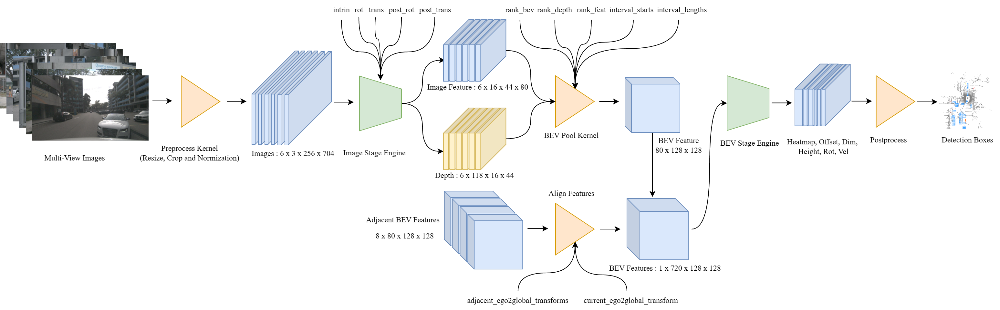

# BEVDet implemented by TensorRT, C++

<div align="center">

[English](../README.md) | 简体中文

</div>

本项目是BEVDet的TensorRT推理实现，使用C++编程。可以在nuScenes数据集上测试，也提供了单个测试样本。BEVDet是一个基于BEV的多相机3D目标检测模型，有关BEVDet的详细说明，可以参考 [BEVDet](https://github.com/HuangJunJie2017/BEVDet)。**导出ONNX模型的脚本在这个[仓库](https://github.com/LCH1238/BEVDet)**。

**NEWS** : 新的分支“one”已经发布。实现了众多TensorRT-Plugin. [bevdet-tensorrt-cpp](https://github.com/LCH1238/bevdet-tensorrt-cpp/tree/one)



本项目实现了:
- 长时序（long-term）模型的推理
- Depth模型的推理
- 在NVIDIA A4000上，BEVDet-r50-lt-depth模型中，TRT FP32模型推理速度比PyTorch FP32模型**快2.38倍**, TRT FP16模型比PyTorch FP32模型**快5.21倍**
- 在**Jetson AGX Orin**上进行推理，FP16模型推理时间在**29m**s左右，实现了实时化
- 实现了Dataloader，可以在nuScenes数据集上进行测试
- 微调了模型，解决了模型对输入resize采样敏感导致mAP与NDS下降的问题
- Int8的量化的尝试

本项目的特点：
- 集Resize、Crop与Normalization于一体的**预处理CUDA Kernel**
- Preprocess的CUDA kernnel部分，实现了Nearest插值和Bicubic插值
- C++与CUDA kernel实现的过往帧BEV特征对齐
- **多线程+多数据流NvJPEG**
- Scale-NMS
- 移除了BEV encoder部分的preprocess网络

接下来要实现的：
- int8量化
- 将bevpool与过往帧BEV特征对齐部分做成插件，整合到engine中
- 异常处理

## Results && Speed
## Inference Speed
 所有的时间单位都是毫秒(ms), 默认使用Nearest插值
||Preprocess|Image stage|BEV pool|Align Feature|BEV stage|Postprocess|mean Total | 
|---|---|---|---|---|---|---|---|
|NVIDIA A4000 FP32|0.478|16.559|0.151|0.899|6.848 |0.558|25.534|
|NVIDIA A4000 FP16|0.512|8.627 |0.168|0.925|2.966 |0.619|13.817|
|NVIDIA A4000 Int8|0.467|3.929 |0.143|0.885|1.771|0.631|7.847| 
|Jetson AGX Orin FP32|2.800|38.09|0.620|2.018|11.893|1.065|55.104|
|Jetson AGX Orin FP16|2.816|17.025|0.571|2.111|5.747 |0.919|29.189|
|Jetson AGX Orin Int8|2.924|10.340|0.596|1.861|4.004|0.982|20.959|


*注：模块的推理时间参考的某一帧的时间，而总时间计算200帧的平均时间*

## Results
|Model   |Description       |mAP   |NDS    |Infer time|
|---     |---               |---   |---    |---       |
|Pytorch |                  |0.3972|0.5074|96.052|
|Pytorch |LSS accelerate<sup>1</sup>   |0.3787|0.4941|86.236|
|Trt FP32|Python Preprocess<sup>2</sup>|0.3776|0.4936|25.534|
|Trt FP32|Bicubic sampler<sup>3</sup>  |0.3723|0.3895|33.960|
|Trt FP32|Nearest sampler<sup>4</sup>  |0.3703|0.4884|25.534|
|Trt FP16|Nearest sampler   |0.3702|0.4883|13.817|
|Pytorch |Nearest sampler <sup>5</sup>   |0.3989|0.5169|——|
|Pytorch |LSS accelerate <sup>5</sup>  |0.3800| 0.4997|——|
|Trt FP16| <sup>5</sup>|0.3785| 0.5013  | 12.738

*注：Pytorch模型不包括预处理时间，上述模型均在NVIDIA A4000上面测试*
1. lss accelerate是指在View transformer阶段，将用于BEVPool映射的数据，计算后预存下来，节省后面的推理速度。预存的数据是根据相机的内外参计算的，因为nuScenes某些场景的内外参有些许不同，导致开启lss accelerate后，性能会下降。如果相机的内参不变，相机坐标系与Ego坐标系的外参也不改变，那么lss accelerate不会导致性能下降。
2. 某些网络对输入非常敏感，Pytorch模型的预处理使用的是PIL的resize，默认Bicubic插值，在推理时无论是使用OpenCV的Bicubic插值，还是自己实现的Bicubic插值，都无法实现Pytorch的精度。猜想网络稍稍过拟合，或者是学到了采样器的某种特征，导致更换插值方法后，精度下降。在这里采用Python预处理作为输入，可以看出TRT模型部分精度没有下降。
3. 如2所言，采用自己实现的Bicubic插值后，达不到Python预处理的性能。
4. Nearest的速度只有Bicubic的二十分之一，最后默认采用Nearest采样。
5. 微调网络，预处理使用C++实现的基于Nearest采样的resize。微调后，网络适应了Nearest采样。


## DataSet
本项目提供了测试样本，也同样可以在nuScenes数据集上进行推理，在nuScenes数据集进行测试时，需要使用本项目提供的data_infos文件夹。data应该是如下结构：

    └── data
        ├── nuscenes
            ├── data_infos
                ├── samples_infos
                    ├── sample0000.yaml
                    ├── sample0001.yaml
                    ├── ...
                ├── samples_info.yaml
                ├── time_sequence.yaml
            ├── samples
            ├── sweeps
            ├── ...
data_infos文件夹，在这里下载 [Google drive](https://drive.google.com/file/d/1RkjzvDJH4ZapYpeGZerQ6YZyervgE1UK/view?usp=drive_link) [Baidu Netdisk](https://pan.baidu.com/s/1TyPoP6OPbkvD9xDRE36qxw?pwd=pa1v)

## Environment
对于桌面或服务器平台：

- CUDA 11.8
- cuDNN 8.6.0
- TensorRT 8.5.2.2
- yaml-cpp
- Eigen3
- libjpeg

对于Jetson AGX Orin

- Jetpack 5.1.1
- CUDA 11.4.315
- cuDNN 8.6.0
- TensorRT 8.5.2.2
- yaml-cpp
- Eigen3
- libjpeg
  
## Compile && Run
请使用本项目提供的ONNX文件，根据脚本自行生成trt engine:
```shell
python tools/export_engine.py cfgs/bevdet_lt_depth.yaml model/img_stage_lt_d.onnx model/bev_stage_lt_d.engine --postfix="_lt_d_fp16" --fp16=True
```
ONNX文件，在此处下载[Baidu Netdisk](https://pan.baidu.com/s/1zkfNdFNilkq4FikMCet5PQ?pwd=bp3z)或者[Google Drive](https://drive.google.com/drive/folders/1jSGT0PhKOmW3fibp6fvlJ7EY6mIBVv6i?usp=drive_link)

```shell
mkdir build && cd build
cmake .. && make
./bevdemo ../configure.yaml
```


## References
- [BEVDet](https://github.com/HuangJunJie2017/BEVDet)
- [mmdetection3d](https://github.com/open-mmlab/mmdetection3d)
- [nuScenes](https://www.nuscenes.org/)
